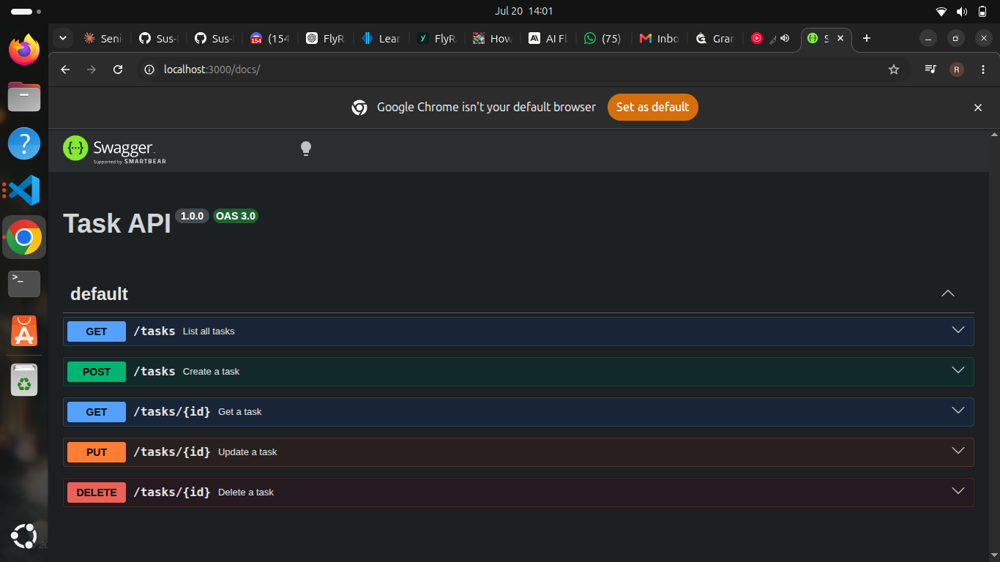

# Task API

A simple CRUD API for managing a to-do list, built with Node.js and Express as part of the FlyRank Backend AI Engineering internship (Assignment BE-01).

Data is stored in memory - it resets every time the server restarts. Persistent storage (a database) comes in a later assignment.

## How to run it

```bash
npm install
node index.js
```

Server starts at `http://localhost:3000`. Interactive docs at `http://localhost:3000/docs`.

## Endpoints

| Method | Path | Description |
|--------|------|-------------|
| GET | / | API info |
| GET | /health | Health check |
| GET | /tasks | List all tasks |
| GET | /tasks/:id | Get one task |
| POST | /tasks | Create a task |
| PUT | /tasks/:id | Update a task |
| DELETE | /tasks/:id | Delete a task |

## Example request

```bash
curl -i -X POST http://localhost:3000/tasks -H "Content-Type: application/json" -d '{"title":"Buy milk"}'
```
```
HTTP/1.1 201 Created
X-Powered-By: Express
Content-Type: application/json; charset=utf-8
Content-Length: 40
ETag: W/"28-PpSBYV7i68cXyGc7AhjVpkZkY5Q"
Date: Tue, 21 Jul 2026 14:22:38 GMT
Connection: keep-alive
Keep-Alive: timeout=5
{"id":4,"title":"Buy milk","done":false}
```

## Swagger UI

Screenshot below shows the full endpoint list with "Try it out" working.



## The mortality experiment

Since tasks are stored in memory, restarting the server wipes all data back to the original 3 seed tasks. This is why a real database is needed for anything that must persist — that's next week's lesson.